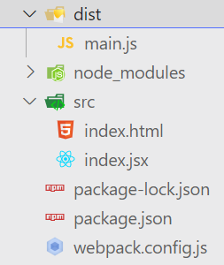
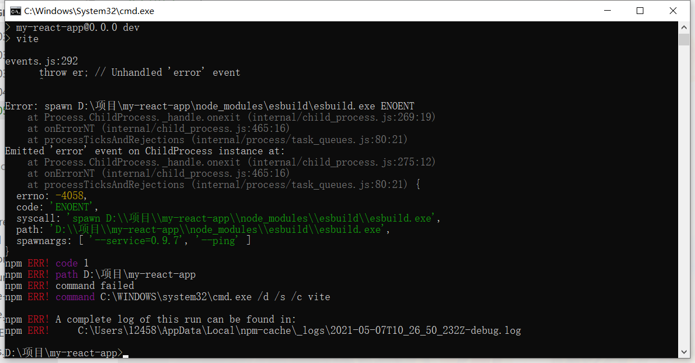
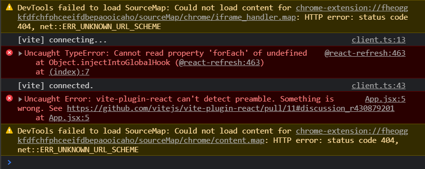

## webpack搭建react项目

### 1. 安装依赖包
```cmd
mkdir react_app
cd react_app
npm init --yes
npm i -D @babel/preset-env @babel/preset-react autoprefixer babel-loader css-loader html-webpack-plugin less less-loader px2rem-loader style-loader webpack webpack-cli webpack-dev-server postcss-loader
npm i --save react react-dom
```

### 2. webpack.config.js
```js
const HtmlWebpackPlugin = require("html-webpack-plugin");
const path = require("path");
module.exports = {
  mode: "development",
  entry: "./src/index.jsx",
  output: {
    path: path.resolve(__dirname, "dist"),
    filename: "main.js",
  },
  devtool: 'source-map',//生成单独的完整的source-map文件，方便开发
  devServer: {
    port: 8080,//开发服务器的端口号
    hot: true,//启动热更新
  },
  module: {
    rules: [
      {
        test: /\.(t|j)sx?$/,
        loader: "babel-loader",
        options: {
          presets: [
            "@babel/preset-env", //解析ES+
            "@babel/preset-react", //解析React JSX语法的
          ],
        },
        include: path.resolve("src"),
        exclude: /node_modules/,
      },
      {
        test: /\.css$/,
        use: [
          "style-loader",
          {
            loader: "css-loader"
          },
        ],
      },
      {
        test: /\.less$/,
        use: [
          "style-loader" ,
          {
            loader: "css-loader", //处理import和url
            options: { importLoaders: 3 }, //import的文件要导入之前需要经过几个loader的处理
          },
          {
            loader: "postcss-loader", //加入厂商的兼容性前缀
            options: {
              postcssOptions: {
                plugins: ["autoprefixer"],
              },
            },
          },
          {
            loader: "px2rem-loader", //可以把px单位变成rem单位
            options: {
              remUnit: 37.5, //在标准设计稿下1rem对应的是75px
              remPrecesion: 8, //计算后的小数精度是8位
            },
          },
          "less-loader", //把less编译成css
        ],
      },
      {
        test: /\.(jpg|png|gif|svg|jpeg)/,
        type: "asset", //以前url-loader或者file-loader，现在不需要
      },
    ],
  },
  plugins: [new HtmlWebpackPlugin({ template: "./src/index.html" })],
};
```

### 3. pageage.json
```js
"scripts": {
    "dev": "webpack server",
    "build": "webpack"
  },
```


## Vite 建立react项目
[vite官网](https://cn.vitejs.dev/guide/#scaffolding-your-first-vite-project)
```cmd
# npm 6.x
npm init @vitejs/app my-react-app --template react

# npm 7+, 需要额外的双横线：
npm init @vitejs/app my-react-app -- --template react
```

- 理论上这样就可以了，但是根据大佬的教程npm run dev直接报错


- 解决(要自己手动执行一下)
```js
node node_modules/esbuild/install.js
npm run dev
```

- 这回我以为可以了，然后浏览器里面又报错

- 解决(关掉安装的浏览器 React Developer Tools 插件,可能是因为我的版本太低了，2.5.2的 4版本的插件是没有问题的)


## TODO
- 问题只是解决了，但是并不知道是为什么