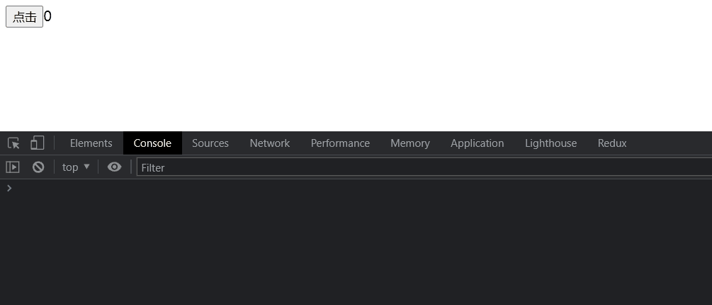

## react18
:::note
- [x] react18 Alpha 已经完成
- [x] react18 beta 已经完成
- [x] **进入到RC版本，需要大概1-2个月，具体还需要看反馈** （12月9号左右）
- [ ] RC结束之后，需要大概2~4周就会发布react18了。
:::

### 自动批处理
如何理解批处理呢？从一道老生常谈的面试题谈起：`setState什么时候是同步的，什么时候是异步的？`
- 来看一下，下面这段代码 （打开控制台点击按钮查看效果）
```jsx
import React, {useState} from 'react';
import ReactDOM from 'react-dom';

const App = () => {
  const [count, setCount] = useState(0);

  const handleClick = () => {
    setCount((count) => count + 1)
    setCount((count) => count + 1)
  }
  console.log(111);

  return <><button onClick={handleClick}>点击</button>{count}</>
}
ReactDOM.render(<App/>, document.getElementById('root'))
```
效果：

熟悉react的朋友，应该都知道，react会合并处理在事件函数和生命周期的setState的渲染，所以上面在console中的123，会打印`1`次。

- 再来看下面这段代码
```jsx {8,11}
import React, {useState} from 'react';
import ReactDOM from 'react-dom';

const App = () => {
  const [count, setCount] = useState(0);

  const handleClick = () => {
    setTimeout(() => {
      setCount((count) => count + 1)
      setCount((count) => count + 1)
    }, 0);
  }
  console.log(111);

  return <><button onClick={handleClick}>点击</button>{count}</>
}
ReactDOM.render(<App/>, document.getElementById('root'))
```
效果：

结果可能大家也都已经知道了，console里面的值被打印了`2`次，也就是说每次点击react组件渲染了2次，在setTimeout中setState的批处理失效了。

> 那道有名的面试题的答案也就出来了。
1. react在事件处理和生命周期函数中是异步处理渲染（合并渲染，也就是批处理）
2. 在异步任务中，如：promise.then，setTimeout等异步任务中，会同步进行渲染（不进行批处理）
- 这样看其实setState在18版本之前只能算是半自动批处理。

**批处理的概念说完了我们来看一下react18做了什么？**
- react18中改掉了这个setState在异步中处理的问题，真正了实现了自动批处理。（狂喜，以后再也不用被setState的面试题支配:sunglasses:）


如何使用react18的自动批处理呢？需要使用到react提供的新的root Api

:::tip
- react提供了一个新的root Api，`ReactDOM.createRoot`用于并发渲染，可以选择优先级更高的任务进行渲染。
- 之前我们使用的`ReactDOM.render()`被称为`legacy模式`，等待按照顺序渲染。
:::

上面的例子不变，我们来看一下，在react18中的表现。
1. 安装包更改为react18@beta版本。
```shell
# 安装方式
npm install react@beta react-dom@beta
```
2. 需要修改react的挂载模式为createRoot Api形式
```diff jsx 
- ReactDOM.render(<App/>, document.getElementById('root'))
+ ReactDOM.createRoot(document.getElementById('root')).render(<App/>);
```
3. 代码 
```jsx
import React, {useState} from 'react';
import ReactDOM from 'react-dom';

const App = () => {
  const [count, setCount] = useState(0);

  const handleClick = () => {
    setTimeout(() => {  // 异步
      setCount((count) => count + 1)
      setCount((count) => count + 1)
    }, 0);
  }
  console.log(111);

  return <><button onClick={handleClick}>点击</button>{count}</>
}

// 这里换成最新的createRoot API
ReactDOM.createRoot(document.getElementById('root')).render(<App/>);
```
效果：

可以看到react18即便是在异步操作中，也不会出现重新渲染两次的情况。达到了真正的自动化批处理。

**那么问题来了，我们并不是总是需要批处理呀，那怎么实现之前需要异步处理的情况呢？react官方提供了一个api，帮助我们处理这种不需要批处理的情况。**
- `ReactDOM.flushSync`
```jsx {9-11}
import React, {useState} from 'react';
import ReactDOM from 'react-dom';

const App = () => {
  const [count, setCount] = useState(0);

  const handleClick = () => {
    setTimeout(() => {
      ReactDOM.flushSync(() => {
        setCount((count) => count + 1)
      })
      setCount((count) => count + 1)
    }, 0);
  }
  console.log(111);

  return <><button onClick={handleClick}>点击</button>{count}</>
}
ReactDOM.createRoot(document.getElementById('root')).render(<App/>);
```
效果：

这样效果的表现和之前放到`异步`的表现是一致的。

- 原理就是把setState放到两个不同的优先级中处理，如果setState的话，react会自动合并两个在一个环境中的setState，判定为优先级相同，那么就会一起批量更新。

<!-- ### Suspense
- react在16.x的时候就已经支持了这个api，但是当时的实现方式，并不是真正的异步更新。在react18中，完成了对这个api的改造
1. Legacy Suspense 中，同级兄弟组件会立即从 DOM 上卸载（mounted），相关的 effects 和生命周期会被触发，最后会隐藏这个组件。具体可以查看[代码示例](https://codesandbox.io/s/keen-banach-nzut8?file=/src/App.js)。
2. Concurrent Suspense 中，同级兄弟组件并不会从 DOM 上卸载，相关的 effects 和生命周期会在 ComponentThatSuspends 处理完成时触发。具体可以查看[代码示例](https://codesandbox.io/s/romantic-architecture-ht3qi?file=/src/App.js)。 -->

### startTransition
> 这个是为了解决，大数据下，渲染顺序的问题。很多时候，同步更新如果js更新内容过大，就会造成用户感受卡顿的感觉。react为了解决这个问题，和fiber开始就已经开始铺路了。这次react18，是全面进行并发的异步模式，让translate变成可能。

#### useTransition

### useDeferredValue

### useSyncExternalStore
> react外部数据传入和更新的时候，都要依赖state的更新，所以传入的外部状态需要转换为state才能被react监听到，这个api是为了让react可以订阅外部数据变化，来让组件的更新，也就是说，我们可以不用手动转换state就可以达到让组件更新


### 参考文档
- [官方react18介绍](https://react.docschina.org/blog/2021/06/08/the-plan-for-react-18.html)
- [react18工作组](https://github.com/reactwg/react-18/discussions/categories/announcement)
- [Behavioral changes to Suspense in React 18](https://github.com/reactwg/react-18/discussions/7)
- [「React18新特性」深度解读之useMutableSource](https://juejin.cn/post/7026210002042011655#heading-0)
- [「React18新特性」深入浅出用户体验大师—transition](https://juejin.cn/post/7027995169211285512)

## react-router v6
> 用户体验更佳
- [官方文档](https://reactrouter.com/)

## redux-toolkit
> redux 官网也非常建议使用tookit

- [官方文档](https://redux-toolkit.js.org/)

## ahooks 3
> 推出了一些新特性
- [官方文档](https://ahooks.gitee.io/zh-CN/hooks/use-request/index)