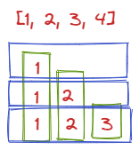

## 选择排序
找到最小的值，把它放到第一个位置。
```javascript
function selectSort(arr) {
    if (!arr.length || arr.length < 2) return arr;
  
    for(let i = 0; i < arr.length; i ++) {
        let min = i;
        for(let j = i + 1; j < arr.length; j ++) {
            min = arr[min] > arr[j] ? j : min
        }

      [arr[min], arr[i]] = [arr[i], arr[min]];
    }
}
let arr = [1,3,324,12,3123,4,23,123]
selectSort(arr)
console.log(arr)
```

## 冒泡排序
一个一个比较，谁大谁往后去。直到比较到最后一个。再从第一个从新开始比较
```javascript
// 比较是 0 - n-1 开始所以第一层循环是 0 - n-1
// 在里面的循环是 0 1 换  1 2 换  2 3 换
function bubbleSort(arr) {
    if (!arr.length || arr.length < 2) return arr;
    // 数组的最后一项到第一项
    for (let end = arr.length - 1; end >= 0; end --) {
        // 定义第二项 和 第一项交换 -> 一直交换到end，因为每一次外层循环会--，
        for(let second = 1; second <= end; second ++) {
            if(arr[second - 1] > arr[second]) {
                [arr[second - 1], arr[second]] = [arr[second], arr[second - 1]]
            }
        }
    }
}
let arr = [1,3,324,12,3123,4,23,123]
bubbleSort(arr)
console.log(arr)
```
## 插入排序
先排 0-0, 0-1 然后0-2 然后0-3 0-4 0-5，就像斗地主玩牌，我摸到一张牌以后往里面插入的时候，就是前面都排好了，然后比较，往里一插就可以了
```javascript
function insertSort(arr) {
    if (!arr.length || arr.length < 2) return arr;
    // 0-0 0-1
    for(let i = 1; i < arr.length; i ++) {
        let num = i;
        while(num > 0 && arr[num - 1] > arr[num]) {
            [arr[num], arr[num - 1]] = [arr[num - 1], arr[num]]
            num--;  // 是为了当前num交换之后，下标应该往前移动。
        }
    }
}
let arr = [1,3,324,12,3123,4,23,123]
insertSort(arr)
console.log(arr)
```
```javascript
function insertSort(arr) {
    if (!arr.length || arr.length < 2) return arr;
    for(let i = 1; i < arr.length; i ++) {
        // 把while循环，变成for循环
        for(let num = i; num > 0 && arr[num - 1] > arr[num]; num --) {
            [arr[num], arr[num - 1]] = [arr[num - 1], arr[num]]
        }
    }
}
let arr = [1,3,324,12,3123,4,23,123]
insertSort(arr)
console.log(arr)
```
## 归并排序
### 递归
```javascript
function mergeSort(arr) {
    if (arr == null || arr.length < 2) {
        return arr;
    }

    // 从第0到最后一项进行排序
    process(arr, 0, arr.length - 1);
}

function process(arr, L, R) {
    if (L == R) {
        return; // 说明就一个数字了，不用排序了。直接返回
    }
    // Math.floor((L + R) / 2) 
    let mid = Math.floor(L + ((R - L) >> 1));
    process(arr, L, mid);
    process(arr, mid + 1, R);
    merge(arr, L, mid, R);
}

function merge(arr, L, M, R) {
    let help = new Array(R - L + 1);
    let i = 0;
    let p1 = L;
    let p2 = M + 1;
    
    while(p1 <= M && p2 <= R) {  // 如果在范围内，就谁小谁动
        help[i++] = arr[p1] <= arr[p2] ? arr[p1++] : arr[p2++];
    }

    while(p1 <= M) {  // p1 有就把p1都补到最后
        help[i++] = arr[p1++];
    }

    while(p2 <= R) {  // p2 有就把p2补到最后
        help[i++] = arr[p2++]; 
    }
    
    // 用help循环。arr要从L开始，这里的i用的是最开始的那个i，其实不用这个i也可以。但是没必要重新申请一个变量
    for(i = 0; i < help.length; i++) {  // 拷贝回原数组
        arr[L + i] = help[i];
    }
}

let arr = [1,3,2,12,3123,4,23,123]
mergeSort(arr)
console.log(arr)
```
### 迭代
```javascript
function merge(arr, L, M, R) {
    let help = new Array(R - L + 1);
    let i = 0;
    let p1 = L;
    let p2 = M + 1;

    while (p1 <= M && p2 <= R) {
        help[i++] = arr[p1] <= arr[p2] ? arr[p1++] : arr[p2++];
    }

    while (p1 <= M) {
        help[i++] = arr[p1++];
    }

    while (p2 <= R) {
        help[i++] = arr[p2++];
    }

    for (i = 0; i < help.length; i++) {
        arr[L + i] = help[i];
    }
}

function mergeSort(arr) {
    if (arr == null && arr.length < 2) {
        return arr;
    }
    let N = arr.length;
    let mergeSize = 1;  // 步长
    while(mergeSize < N) {  // 步长不能超过N
        let L = 0;
        while(L < N) {  // 左边界不能超过N
            let M = L + mergeSize - 1;  // 计算中点。L + 步长 - 1的距离
            if (M >= N) {  // M 也不能超过 N
                break;
            }
            //  M + mergeSize = M + 1 + mergeSize - 1
            let R = Math.min(N - 1, M + mergeSize); // 计算R，右边界如果是最边上，就取数组长度，如果不是就取M + 步长
            merge(arr, L, R, M);  // 有了 L, M , R 进行merge操作
            L = R + 1;  // 移动L的位置。继续下一次循环
        }
        if (mergeSize > N / 2) {  // 防止步长越界，如果步长下一次大于了总长度的一半就停止循环
            break;
        }
        mergeSize <<= 1  // 步长乘2
    }
}

let arr = [1, 3, 2, 12, 3123, 4, 23, 123]
mergeSort(arr)
console.log(arr)
```
#### 对数器
```javascript
function mergeSort2(arr) {
    if (!arr || arr.length < 2) {
        return arr;
    }
    let N = arr.length;
    let mergeSize = 1;
    while(mergeSize < N) {
        let L = 0;
        while(L < N) {
            let M = L + mergeSize - 1;
            if (M >= N) {
                break;
            }

            let R = Math.min(N - 1, mergeSize + M);
            merge(arr, L,M,R);
            L = R + 1;
        }
        mergeSize <<= 1;
    }
}

function mergeSort1(arr) {
    if (!arr || arr.length < 2) {
        return arr;
    }
    process(arr, 0, arr.length - 1);
}


function process(arr, L, R) {
    if (L == R) {
        return;
    }

    let mid = Math.floor(L + ((R - L) >> 1));
    process(arr, L, mid);
    process(arr, mid + 1, R);
    merge(arr, L, mid, R);
}

function merge(arr, L, M, R) {
    let help = new Array(R - L + 1);
    let i = 0;
    let p1 = L;
    let p2 = M + 1;
    while (p1 <= M && p2 <= R) {
        help[i++] = arr[p1] <= arr[p2] ? arr[p1++] : arr[p2++];
    }

    while(p1 <= M) {
        help[i++] = arr[p1++];
    }

    while(p2 <= R) {
        help[i++] = arr[p2++];
    }

    for ( i = 0; i < help.length; i ++) {
        arr[L + i] = help[i];
    }
}


function lenRandomValueRandom(maxlen, maxvalue) {
	let len = Math.floor(Math.random() * maxlen)
    let arr = new Array(len);
    for(let i = 0; i < arr.length; i ++) {
        arr[i] = Math.floor(Math.random() * maxvalue)
    }
    return arr;
}

function copy(arr) {
    let help = [];
    for(let i = 0; i < arr.length; i ++) {
        help[i] = arr[i]
    }
    return help
}

function main() {
    let maxlen = 100;
    let maxvalue = 1000;
    let timeout = 100;
    for (let i = 0; i < timeout; i ++) {
        let arr = lenRandomValueRandom(maxlen, maxvalue)
        let copyArr = copy(arr);
        mergeSort1(arr);
        mergeSort2(copyArr)
        for (let j = 0; j < arr.length; j ++) {
            if (arr[j] !== copyArr[j]) {
                console.log(arr, copyArr);
                console.log('error');
                break;
            }
        }
    }
}
main()
```

### 小和问题
在一个数组中，每一个元素左边比它小的数累加起来，得到的累加和就是小和。

1. 转换为用当前的数 乘 右侧比他大的数的数量


- 横着的是，小和问题的描述。
- 竖着的是，转换为当前数*右侧比他大的数

2. 在排序的过程中找到，右组不产生小和。左组才会产生小和
2. 左组和右组一样的时候，先移动右组
```javascript
function samllSum(arr) {
    if (arr == null || arr.length < 2) {
        return 0  // 没有直接返回0
    }
    return process(arr, 0, arr.length - 1);
}

function process(arr, L, R) {
    if (L === R) {
        return 0; // 相等返回0
    } 

    let mid = Math.floor(L + ((R - L) >> 1));  // 计算中点
    
    // 返回左边，右边，merge后相加的小和
    return process(arr, L, mid) + process(arr, mid + 1, R) + merge(arr, L, R, mid)
}

function merge(arr, L, R, mid) {
    let help = new Array(R - L + 1)
    let i = 0;
    let p1 = L;
    let p2 = mid + 1;
    let res = 0;
    while (p1 <= mid && p2 <= R) {
        // 如果左边的比右边的小，计算右边的距离 * 左边的数。否则就是0
        res += arr[p1] < arr[p2] ? (R - p2 + 1) * arr[p1] : 0;
        // 注意这里 需要是 左边和右边相同时。先动右边
        help[i++] = arr[p1] < arr[p2] ? arr[p1++] : arr[p2++];
    }

    while(p1 <= mid) {
        help[i++] = arr[p1++];
    }

    while(p2 <= R) {
        help[i++] = arr[p2++];
    }

    for(i = 0; i < help.length; i ++) {
        arr[L + i] = help[i];
    }
    return res;
}


let arr = [1,2,3,4]
console.log(samllSum(arr));  // 10
```
#### 对数器
```javascript
function sumallSum(arr) {
  if (!arr || arr.length < 2) {
    return 0;
  }
  return process(arr, 0, arr.length - 1);
}

function process(arr, L, R) {
  if (L == R) {
    return 0;
  }
  
  let mid = Math.floor(L + ((R - L) >> 1));
  return process(arr, L, mid) + process(arr, mid + 1, R) + merge(arr, L, mid, R);
}

function merge(arr, L, M, R) {
  let help = new Array(R - L + 1);
  let i = 0;
  let p1 = L;
  let p2 = M + 1;
  let res = 0
  while (p1 <= M && p2 <= R) {
    res += arr[p1] < arr[p2] ? arr[p1] * (R - p2 + 1) : 0
    help[i++] = arr[p1] < arr[p2] ? arr[p1++] : arr[p2++];
  }
  
  while(p1 <= M) {
    help[i++] = arr[p1++];
  }
  
  while(p2 <= R) {
    help[i++] = arr[p2++];
  }
  
  for ( i = 0; i < help.length; i ++) {
    arr[L + i] = help[i];
  }
  return res;
}

// 左边比右边小的数的和
function sumallSum2(arr) {
  let res = 0;
  for (let i = 1; i < arr.length; i ++) {
    for (let j = 0; j < i; j ++) {
      res += arr[i] > arr[j] ? arr[j] : 0;
    }
  }
  return res;
}

function lenRandomValueRandom(maxlen, maxvalue) {
  let len = Math.floor(Math.random() * maxlen)
  let arr = new Array(len);
  for(let i = 0; i < arr.length; i ++) {
    arr[i] = Math.floor(Math.random() * maxvalue)
  }
  return arr;
}

function copy(arr) {
  let help = [];
  for(let i = 0; i < arr.length; i ++) {
    help[i] = arr[i]
  }
  return help
}

function main() {
  let maxlen = 1000;
  let maxvalue = 1000;
  let timeout = 1000;
  for (let i = 0; i < timeout; i ++) {
    let arr = lenRandomValueRandom(maxlen, maxvalue)
    let copyArr = copy(arr);
    let a = sumallSum(arr);
    let b = sumallSum2(copyArr);
    if (sumallSum(arr) !== sumallSum2(arr)) {
      console.log('error',arr);
    }
  }
}
main()
```
### 逆序对
一个数组中左边的数比右边的数小，看一组数中有多少个逆序对。
[1,2,3] -> 0对
[3,2,1] -> 3,2    3,1    2,1    3对

解释：右边有多少个数比当前数小

1. 从右往左拷贝
1. 求右边有多少个数比当前数小
1. 两个数谁大 拷贝谁， 相等的时候先拷贝右边的
```javascript
function reverPairNumber(arr) {
    if (arr == null || arr.length < 2) {
        return 0
    }
    return process(arr, 0, arr.length - 1);
}

function process(arr, L, R) {
    if (L === R) {
        return 0;
    } 

    let mid = Math.floor(L + ((R - L) >> 1));

    return process(arr, L, mid) + process(arr, mid + 1, R) + merge(arr, L, R, mid)
}

function merge(arr, L, R, mid) {
    let help = new Array(R - L + 1)
    let i = help.length - 1;  // 逆序
    let p1 = mid;  // 倒过来p1开始位置在中间
    let p2 = R;  // p2在最右边
    let res = 0;
                 // p2 >= mid + 1
    while (p1 >= L && p2 > mid) {	// 求一共有多少个逆序对
                                  // p2 - (mid + 1) + 1 = p2 - mid
        res += arr[p1] > arr[p2] ? (p2 - mid) : 0;
        //  倒着排序，先拿大的
        help[i--] = arr[p1] > arr[p2] ? arr[p1--] : arr[p2--];
    }

    while(p1 >= L) {
        help[i--] = arr[p1--];
    }
    
    // p2 >= mid + 1
    while(p2 > mid) {
        help[i--] = arr[p2--];
    }

    for(i = 0; i < help.length; i ++) {
        arr[L + i] = help[i];
    }
    return res;
}


let arr = [4,3,2,1]
console.log(reverPairNumber(arr));  // 6
```
### 2倍问题
求左边的数 大于右边数的两倍的个数
```javascript
function biggerThanRightTwice(arr) {
    if (arr == null || arr.length < 2) {
        return 0
    }
    return process(arr, 0, arr.length - 1);
}

function process(arr, L, R) {
    if (L === R) {
        return 0;
    } 

    let mid = Math.floor(L + ((R - L) >> 1));

    return process(arr, L, mid) + process(arr, mid + 1, R) + merge(arr, L, R, mid)
}

function merge(arr, L, R, mid) {
    let ans = 0
    let windowR = mid + 1;  // 窗口位置，不会回头
    // 循环左半边
    for (let i = L; i <= mid; i ++) {
        // 跟右半边比较，符合条件就记录
        while(windowR <= R && arr[i] > (arr[windowR] << 1)) {
            windowR ++;
        }
        // 计算个数添加
        ans += windowR - (mid + 1);
    }
    // 然后merge排序
    let help = new Array(R - L + 1)
    let i = 0;
    let p1 = L;
    let p2 = mid + 1;
    while(p1 <= mid && p2 <= R) {
        help[i++] = arr[p1] <= arr[p2] ? arr[p1++] : arr[p2++];
    }

    while(p1 <= mid) {
        help[i++] = arr[p1++];
    }

    while(p2 <= R) {
        help[i++] = arr[p2++];
    }

    for(i = 0; i < help.length; i ++) {
        arr[L + i] = help[i];
    }
    return ans;
}

function comparator(arr) {
    let ans = 0;
    for (let i = 0; i < arr.length; i++) {
        for (let j = i + 1; j < arr.length; j++) {
            if (arr[i] > (arr[j] << 1)) {
                ans++;
            }
        }
    }
    return ans;
}


let arr = [4,3,2,1]
let arr1 = [4,3,2,1]
console.log(biggerThanRightTwice(arr));
console.log(comparator(arr1));
```
### 区间和的个数
[区间和的个数 leetcode](https://leetcode-cn.com/problems/count-of-range-sum/?utm_source=LCUS&utm_medium=ip_redirect&utm_campaign=transfer2china)
## 快速排序（随机快排）
### <=x 在左，>x在右

1. 当前数  <= x， 小于区域的下一个数，和 当前数交换，然后小于区域右扩
1. 当x大于当前i位置的时候，不做交换直接 i++;
```javascript
function swap(arr, i, j) {
    [arr[j], arr[i]] = [arr[i], arr[j]]
}

// arr[L..R]上，以arr[R]位置的数做划分值
function partition(arr, L, R) {
    if (L > R) {  // 不存在
        return -1;
    }

    if (L === R) {  // 直接返回
        return L;
    }

    let lessEqual = L - 1;  // 最小值的初始值，L的前一个下标位置
    let index = L;  // 从L开始
    while (index < R) {  // 一直遍历到R的前一项，所以不用等于R
        if (arr[index] <= arr[R]) { // 如果当前小于等于R
            swap(arr, index, ++lessEqual)  // 交换位置，当前项和 less范围的下一个位置交换。++是先+后运算
        }
        index++;  // 如果不小于，直接++，小于交换完++
    }
    swap(arr, ++lessEqual, R);  // 循环完成之后，需要把R位置得数，放到小于x的数的最后一个后面
    return lessEqual  // 返回小于等于x的下标
}

let a = [1, 4, 6, 2, 3, 3];
console.log(partition(a, 0, a.length - 1));  // 3
```
### 荷兰国旗问题
<x在左， =x在中间， >x在右

1. 当前数 == x  直接 i++;
1. 当前数  < x， 小于区域的下一个数，和 当前数交换，然后小于区域右扩
1. 当前数 > x，大于区域的前一个数，和当前数交换，当前下标不动。 大于区域左扩
1. 最后 R 和 大于区域的 第一个交换
```javascript
function swap(arr, i, j) {
    [arr[j], arr[i]] = [arr[i], arr[j]]
}

function netherlandsFlag(arr, L, R) {
    if (L > R) {
        return [-1, -1];
    }

    if (L == R) {
        return [L, R];
    }
    let less = L - 1;  // 开头的前一个位置
    let more = R;  // 数组的尾，不想让R位置参与，所以R先放到大于区域里面，所以不是R + 1位置
    let index = L;  // 从L 开始

    while(index < more) {  // 当前位置不能和大于区域左边撞上，双指针
        if (arr[index] === arr[R]) {
            index++;
        } else if (arr[index] < arr[R]) {
            swap(arr, index++, ++less);
        } else {
            swap(arr, index, --more);
        }
    }
    swap(arr, more, R);
    return [less + 1, more] // 小于的下一个数，当前的more
}

let a = [1, 4, 3, 6, 2, 3, 3];
console.log(netherlandsFlag(a, 0, a.length - 1));  // [2, 4]
```
### 快排2.0版本
- 时间复杂度 O(n2)
- 额外空间复杂度O(n)
```javascript
function swap(arr, i, j) {
    [arr[j], arr[i]] = [arr[i], arr[j]]
}

function netherlandsFlag(arr, L, R) {
    if (L > R) {
        return [-1, -1];
    }

    if (L == R) {
        return [L, R];
    }

    let less = L - 1;
    let more = R;
    let index = L;

    while(index < more) {
        if (arr[index] == arr[R]) {
            index ++;
        } else if (arr[index] < arr[R]) {
            swap(arr, index++, ++less)
        } else {
            swap(arr, index, --more);
        }
    }
    swap(arr, more, R);
    return [less + 1, more];
}

function quickSort2(arr) {
    if (arr == null || arr.length < 2) {
        return arr;
    }

    process(arr, 0, arr.length - 1);
}

function process(arr, L, R) {
    if(L >= R) {
        return;
    }
    // 用荷兰国旗问题获得左右最大值最小值边界
    let [left, right] = netherlandsFlag(arr, L, R); 
    process(arr, L, left - 1); // 继续递归
    process(arr, right + 1, R)
}

let a = [1, 4, 3, 6, 2,  3];
quickSort2(a)
console.log(a);  // [ 1, 2, 3, 3, 4, 6 ]
```
### 快排 3.0 版本
- 时间复杂度O(nlogn)
- 额外空间复杂度O(logn)
```javascript
function swap(arr, i, j) {
    [arr[j], arr[i]] = [arr[i], arr[j]]
}

function netherlandsFlag(arr, L, R) {
    if (L > R) {
        return [-1, -1];
    }

    if (L == R) {
        return [L, R];
    }

    let less = L - 1;
    let more = R;
    let index = L;

    while(index < more) {
        if (arr[index] == arr[R]) {
            index ++;
        } else if (arr[index] < arr[R]) {
            swap(arr, index++, ++less)
        } else {
            swap(arr, index, --more);
        }
    }
    swap(arr, more, R);
    return [less + 1, more];
}

function quickSort3(arr) {
    if (arr == null || arr.length < 2) {
        return arr;
    }

    process(arr, 0, arr.length - 1);
}

function process(arr, L, R) {
    if(L >= R) {
        return;
    }
    // 获得一个随机数与R交换。把概率变成1/N
    // * 一定要注意这里需要 L + 一个随机数
    // highlight-next-line
    swap(arr, L + Math.floor(Math.random() * (R - L + 1)), R)
    // 用荷兰国旗问题获得左右最大值最小值边界
    let [left, right] = netherlandsFlag(arr, L, R); 
    process(arr, L, left - 1); // 继续递归
    process(arr, right + 1, R)
}

let a = [1, 4, 3, 6, 2,  3];
quickSort3(a)
console.log(a);  // [ 1, 2, 3, 3, 4, 6 ]
```
### 迭代
```javascript
function swap(arr, i, j) {
    [arr[j], arr[i]] = [arr[i], arr[j]]
}

function netherlandsFlag(arr, L, R) {
    if (L > R) {
        return [-1, -1];
    }

    if (L == R) {
        return [L, R];
    }

    let less = L - 1;
    let more = R;
    let index = L;

    while(index < more) {
        if (arr[index] == arr[R]) {
            index ++;
        } else if (arr[index] < arr[R]) {
            swap(arr, index++, ++less)
        } else {
            swap(arr, index, --more);
        }
    }
    swap(arr, more, R);
    return [less + 1, more];
}


function opObj(l, r) {
    return { l, r }
}

function quickSort(arr) {
    if (arr == null || arr.length < 2) {
        return arr;
    }
    let N = arr.length;
    swap(arr, Math.floor(Math.random() * N), N - 1);  // 随机一个数
    let [left, right] = netherlandsFlag(arr, 0, N - 1);  // 获得左右区域
    let stack = [];
    stack.push(opObj(0, left - 1))  // 记录中点压栈
    stack.push(opObj(right + 1, N - 1));

    while(stack.length) {
        let op = stack.pop();  // 取出最上面的一项
        if (op.l < op.r) {
            swap(arr, op.l + Math.floor(Math.random() * (op.r - op.l + 1)), op.r);
            let [left, right] = netherlandsFlag(arr, op.l, op.r);
            stack.push(opObj(op.l, left - 1));
            stack.push(opObj(right + 1, op.r));
        }
    }
}

let a = [1, 4, 3, 6, 2,  3];
quickSort(a)
console.log(a);  // [ 1, 2, 3, 3, 4, 6 ]
```
