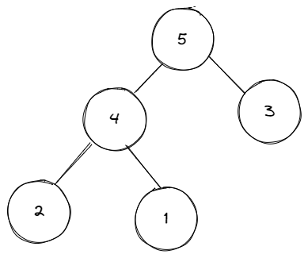
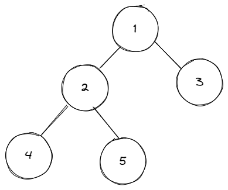

## 什么是堆
- 需要满足一下两个条件
1. 完全二叉树；
2. 每一个节点的值都必须 大于等于或者小于等于 其孩子节点的值。

- 具有以下特点
1. 可以在 `O(logN)`的时间复杂度内向**堆**中插入元素；
2. 可以在`O(logN)` 的时间复杂度内向**堆**中删除元素；
3. 可以在 `O(1)` 的时间复杂度内获取**堆**中的最大值或最小值。

### 大顶堆
堆中每一个节点的值 都大于等于 其孩子节点的值。所以最大堆的特性是 堆顶元素（根节点）是堆中的最大值。

### 小顶堆
堆中每一个节点的值 都小于等于 其孩子节点的值。所以最小堆的特性是 堆顶元素（根节点）是堆中的最小值。

## 堆的实现

### 前置概念
- 如何通过当前元素下标求出父节点，左子节点，右子节点

```ts
// 求父节点
const parentIndex = Math.floor((index - 1)/2);
// 求左子节点
let leftIndex  = index * 2 + 1;
// 求右子节点
let rightIndex = index * 2 + 2;
```


- 如图中，当前堆为`[5,4,3,2,1]`，那么堆尾元素`1`的**下标**是`length - 1 = 4`，那么他的父节点下标为`Math.floor((4-1)/2) = 1`，再通过父节点下标，求出左右节点为`1*2+1 = 3，1*2+2 = 4`

### 代码（小顶堆）
```ts
class Heap {
    data: number[] // 定义堆
    constructor(data:number[] = []) {
        this.data = data;
        this.heapify();  
    }

    size():number {
        return this.data.length;  // 计算堆的长度
    }

    // 初始化堆
    heapify():void {
        // 只有一个元素不进行操作
        if(this.size() < 2) return;
        // 对初始数组进行循环
        for(let i = 1; i < this.size(); i ++ ) {
            this.bubbleUp(i); // 对当前项，进行判断上浮操作。
        }
    }

    // 插入
    offer(val) {
        this.data.push(val);
        this.bubbleUp(this.size() - 1);
    }

    // 弹出
    poll():number | null {
        if(!this.size()) return null;
        const res = this.data[0];  // 先把第一项存下来
        this.data[0] = this.data.pop() as number; // 然后把堆尾元素给到堆首
        this.bubbleDown(0);  // 接着进行判断下浮操作
        return res; // 返回刚刚存的堆首元素
    }

    // 做一个值交换的操作
    swap(i:number, j:number):void {
        if(i === j ) return;
        [this.data[i], this.data[j]] = [this.data[j], this.data[i]]
    }

    // 上浮
    bubbleUp(index:number):void {
        // 元素没有到堆首就一直循环
        while(index > 0) {
            let parentIndex = Math.floor((index - 1)/2); // 求父节点
            // let parentIndex = (index - 1) >> 1; // 同上面的代码

            // 如果当前值大于父节点，不操作。符合小顶堆概念
            if (this.data[index] > this.data[parentIndex]) break;  
            this.swap(index, parentIndex);  // 不符合堆，就把当前节点的内容换到父节点
            index = parentIndex; // 然后再从父节点继续向上比较
        }
    }
    
    // 下浮
    bubbleDown(index:number):void {
        let lastIndex = this.size() - 1;  // 获取堆尾节点
        while(index < lastIndex) {   // 当前下标 大于 最后的下标就已经遍历到堆尾了，不在继续了。
            let leftIndex  = index * 2 + 1;  // 左节点
            let rightIndex = index * 2 + 2;  // 右节点

            let findIndex = index;  // 存下当前下标进行比较。
            // 用当前下标和左右节点分别比较大小，如果当前节点大于左右节点，就把当前节点换成左右节点。
            if(this.data[leftIndex] < this.data[findIndex]) {
                findIndex = leftIndex;
            }
            if(this.data[rightIndex] < this.data[findIndex]) {
                findIndex = rightIndex;
            }
            // 比较之后，两者如果一样说明没有改变，就结束循环
            if(index === findIndex) break;
            this.swap(index,findIndex);  // 如果改变交换节点
            index = findIndex;  // 让当前值为改变后的下标，继续循环
        }
    }
}

const arr = [2,3,4,5,6,7,1]
const heap = new Heap(arr);
```

## leetcode
- 堆常用于解决topk问题

## 堆的其他应用