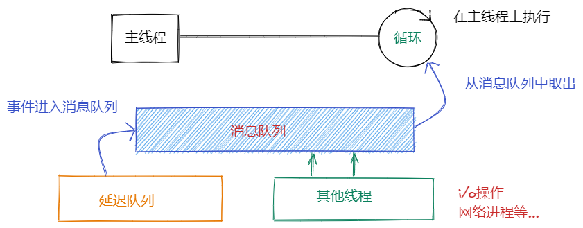
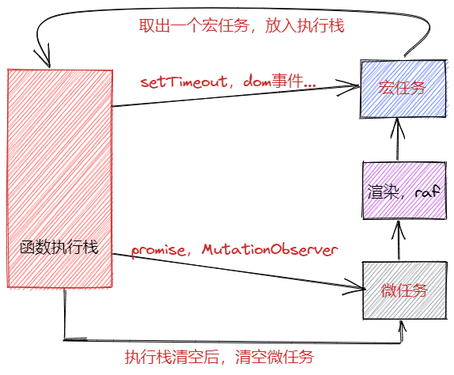

> 浏览器主线程，需要进行渲染，执行js的各种任务。是通过什么让他们有条不紊的工作呢？就是浏览器的事件循环机制

## 理解事件循环
事件循环就是为了处理浏览器的各种事件任务的调度机制。

### 一个任务
从简入繁。浏览器如果当前只有一个任务会怎么执行?
```js
let a = 1;
```
任务不需要做任何处理，直接就会执行。

### 用户输入事件
如果有一个交互事件要怎么办？

```js
let a = 1;

function inputChange () => {
    e.targe.value
}
```
1. 任务变多了
2. 有一个任务不知道什么时候执行

- 这个时候，我们需要一个东西能来一直等待这这个事件的到来。循环出现了。

### 网络请求
```js
let a = 1;

function inputChange (e) {
    e.targe.value
}

function query () {
    // 请求
}
```
1. 出现了其他线程的任务
2. 出现了异步任务

- 这就涉及到了和网络线程的交互，也不止有网络线程，还有其他线程，就需要一个`队列`来管理，各个地方来的事件。
- 异步任务，在没有执行之前，需要放到专门管理异步任务的延迟队列中，等到延迟的时间到了，拿出来放到消息队列中，排队执行。



## 微任务宏任务
> 即使都是异步任务，为什么微任务的优先级要更高？

### 微任务
1. 产生的原因
- 由于setTimeout的执行时间，精准度很难控制，浏览器想更精准的处理一些事情。
- 浏览器需要处理一些优先级高的任务。比如dom的增删改查的监听工作`MutationObserver`。网络请求`promise`

2. 执行时机
- 在当前执行栈结束之后，下一个宏任务执行之前。会清空所有微任务。
- 如果在执行宏任务的时候插入了新的微任务，同样会优先与当前宏任务执行。

3. 与宏任务的关系
- 与宏任务是绑定关系，每一个宏任务在执行时，会为自己创建微任务
- 微任务一定优先于宏任务执行
- 微任务的执行时长会影响宏任务的总时长

### 宏任务
- 渲染事件（如解析 DOM、计算布局、绘制）；
- 用户交互事件（如鼠标点击、滚动页面、放大缩小等）；
- JavaScript 脚本执行事件；
- 网络请求完成、文件读写完成事件。

### 执行图


## 经典面试题

### 任务与渲染

```html
<script>
    document.body.style.background = 'red';
    console.log(1)
    Promise.resolve().then(()=>{
        console.log(2)
        document.body.style.background = 'yellow';
    })
    console.log(3);
</script>
```
<details>
<summary>答案</summary>
<p>输出：1，3，2</p>
<p>页面的颜色：直接变为黄色</p>
<p>原因：promise.then是微任务，所以会在同步代码执行完成后再执行。微任务是在渲染前执行完成的，所以并不会造成页面从red->yellow</p>
</details>

```html
<script>
    document.body.style.background = 'red';
    console.log(1)
    setTimeout(()=>{
        console.log(2)
        document.body.style.background = 'yellow';
    })
    console.log(3);
</script>
```
<details>
<summary>答案</summary>
<p>输出：1，3，2</p>
<p>页面的颜色：可能会直接变为黄色，可能red->yellow</p>
<p>原因：setTimeout是宏任务，所以会在同步代码执行完成后再执行。因为渲染在浏览器中不是每一次都渲染的，浏览器有自己的刷新速率，大概是`16.6ms`，所以如果在这个时间代码已经执行完了，就不会有red->yellow，反之已经渲染了，就会出现闪烁的情况</p>
</details>

### 事件任务
1. 用户点击触发事件

```html
<script>
    button.addEventListener('click',()=>{
        console.log('listener1');
        Promise.resolve().then(()=>console.log('micro task1'))
    });
    button.addEventListener('click',()=>{
        console.log('listener2');
        Promise.resolve().then(()=>console.log('micro task2'))
    });
    button.click(); 
</script>
```
<details>
<summary>答案</summary>
<p>在用户点击的情况下，会先执行一个函数，先执行函数中的同步任务，然后执行微任务。结果是listener1，micro task1 listener2 micro task2</p>
</details>

2. 直接通过普通调用函数的方式调用事件函数

```html
<script>
    button.addEventListener('click',()=>{
        console.log('listener1');
        Promise.resolve().then(()=>console.log('micro task1'))
    });
    button.addEventListener('click',()=>{
        console.log('listener2');
        Promise.resolve().then(()=>console.log('micro task2'))
    });
    click1() click2()
</script>
```

<details>
<summary>答案</summary>
<p>函数普通调用，函数会按照顺序执行，先执行两个同步任务，然后执行两个微任务。结果是：listener1 listener2 micro task1 micro task2</p>
</details>

### 定时器
```html
<script>
        Promise.resolve().then(() => {
            console.log('Promise1')
            setTimeout(() => {
                console.log('setTimeout2')
            }, 0);
        })
        setTimeout(() => {
            console.log('setTimeout1');
            Promise.resolve().then(() => {
                console.log('Promise2')
            })
        }, 0);
</script>
```
<details>
<summary>答案</summary>
<p>Promise1 setTimeout1 Promise2 setTimeout2</p>
<p>原因：先执行微任务，把setTimeout2放到宏任务队列中。然后遇到了下一个代码 setTimeout1，执行，接着遇到微任务 执行Promise2，然后从宏任务队列中取出刚刚的setTimeout1</p>
</details>

### aysnc await
```js
console.log(1);
async function async () {
    console.log(2);
    await console.log(3);
    console.log(4)
}
setTimeout(() => {
	console.log(5);
}, 0);
const promise = new Promise((resolve, reject) => {
    console.log(6);
    resolve(7)
})
promise.then(res => {
	console.log(res)
})
async (); 
console.log(8);
```

<details>
<summary>答案</summary>
<p>1 6 2 3 8 7 4 5</p>
<p>先执行1，然后往下看promise执行器中有一个6，执行，然后async函数执行，2，3,接着执行8，然后取微任务，按顺序，先promise.then的7，然后async函数里面的4,接着宏任务5</p>
</details>

## 参考文档
- 浏览器工作原理与实践 https://time.geekbang.org/column/article/132931
