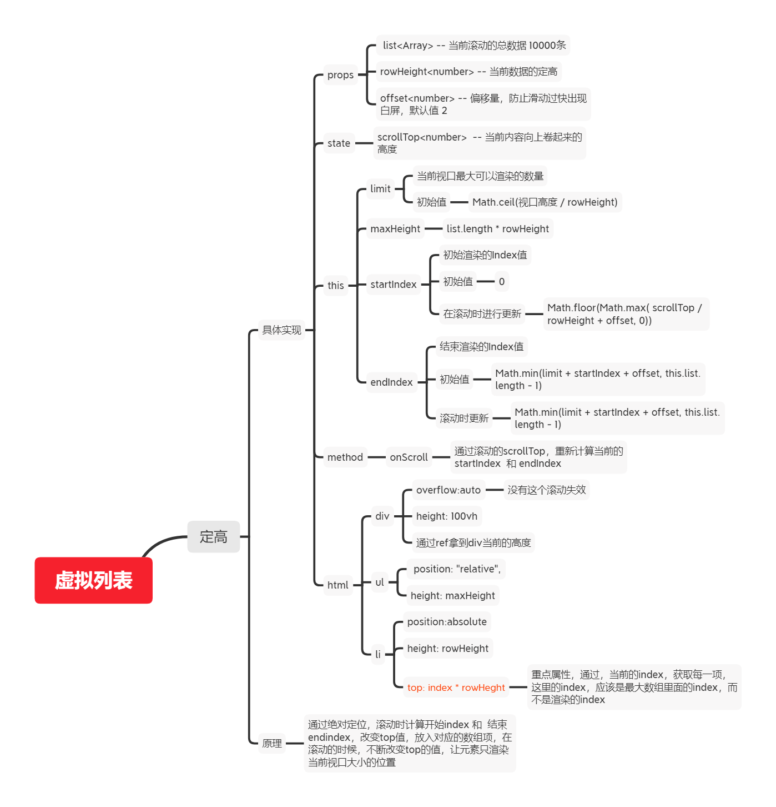

## 虚拟列表

### 定高
- [demo代码](https://codesandbox.io/s/vlist-fixedheight-10d06)

1. 传入3个属性
   - 从后端获取的数据 -- list
   - 每一条数据的高度 -- rowHeight
   - 偏移量 （用于滚动的时候不白屏）  -- offset
2. 初始化属性 
   - 初始下标值 0  -- startIndex
   - scrollTop 0  -- scrollTop
   - 用`ref`拿当前视口的高度。 -- screenHeight
3. 计算3个属性
   - 当前元素的总高度`total` = 每一条数据的高度`rowHeight` * 从后端获取的数据的长度`list.length - 1`
   - 当前视口的能容纳的条目数量`limit` = 当前视口高度`screenHeight` / 每一条数据的高度`rowHeight`
   - 初始化时渲染数组的最大下标值endIndex = 初始下标值`startIndex` + 当前视口能容纳的数量`limit` + 偏移量`offset`
4. 一个方法 -- scroll
    - 通过`scrollTop` 去计算新的 **初始下标`startIndex` 和 结束下标`endIndex`** 在数组中截取，渲染最新的数据
    - 同时通过`slice`截取的数据，拿到在最大的数组的下标值，进行`top`值的渲染
### 不定高
- [demo代码](https://codesandbox.io/s/vlist-noheight-q6o5v?file=/src/App.js)
<!-- TODO 导图和md待整理 -->