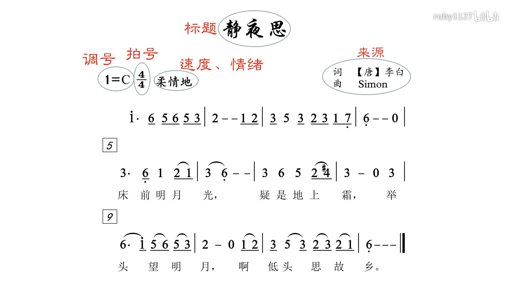
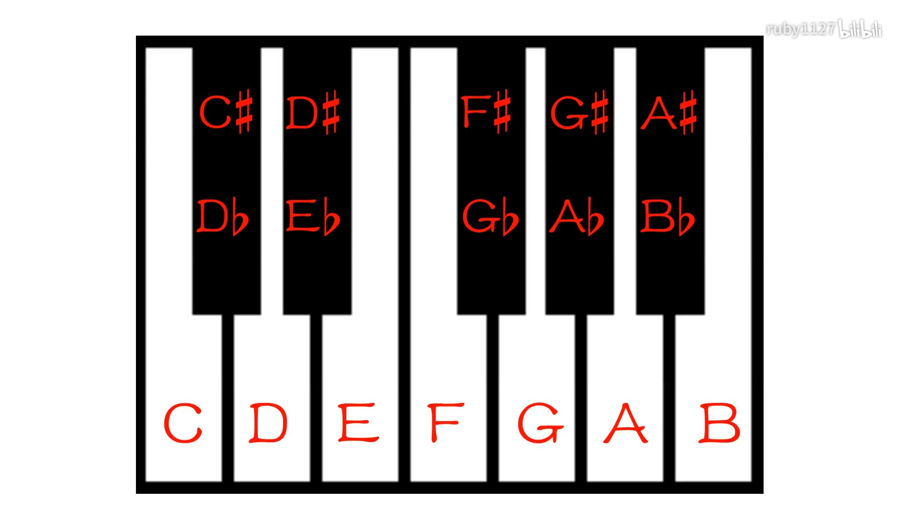
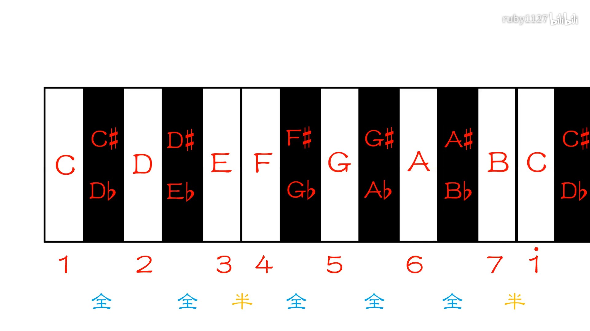
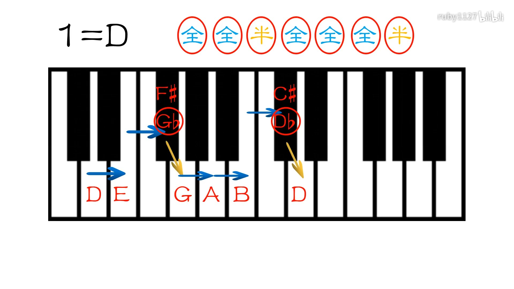

> 笔记整理来自--[零基础自学音乐学乐理合集](https://www.bilibili.com/video/BV12W411f7YF?p=1)

## 1. 初始简谱的构成和唱名

### 简谱的构成
- 标题`就是一个歌曲的名字`
- 来源`词曲作者`
- 调号`key，就是各大音乐综艺里面，说你能再升上一个key的那个音调、音高的意思`
- 拍号`音乐的律动，动次、动次次、动次打次，是音乐的节奏`
- 速度、情绪`音乐的速度和情绪，告诉演唱者，应该用什么情绪演奏`
- 正文`正文里面的数字，就是唱名`

### 唱名
- 1`do` 2`re` 3`mi` 4`fa` 5`sol` 6`la` 7`si`

## 2. 认识音名
> 音名就相当于一个人的名字，是在任何条件下都不会改变的。每一个琴键都有自己的音名。

- C`do` D`re` E`mi` F`fa` G`sol` A`la` B`si`

## 3. 1=C
- 1等于那个音名，1的调就已经确定了
- 其他234567也就跟着确定了

## 4. 钢琴黑键的表示
- `#` 升调
- `b` 降调
- 每一个黑键都有两个名称，与C相邻的，在C右边升C`C#` 和 与D相邻在D左边的降D `Db`

## 5. 全音和半音
- 半音：就是音到音之间的距离，从钢琴按键上看，相邻的两个音是一个半音。`C -> C#` 是半音， `E -> F`也是半音
- 全音：半音 + 半音 = 全音，`C -> D` 就是一个全音，因为`C -> C#/Db -> D`，C中间要走过一个升C或者降D
## 6. 12345671的内在规则
- `C -> C#/Db -> D -> D#/Eb -> E -> F -> F#/Gb -> G -> G#/Ab -> A -> A#/Bb -> B -> C`
- 12345671就是`全全半全全全半`

## 7. 调式中的（自然）大调
- 调式：一串音，按一定的规则排列起来
- 自然大调：简称大调，说的就是 `全全半全全全半`的规则。
- C大调就是从C开始执行`全全半全全全半`的规则， D大调就是从D开始执行`全全半全全全半`的规则

## 8. 构建（自然）大调中的音阶
- 音阶：一个调式里面，它所使用的这些音，按照从低到高的顺序排列起来，由主音开始，主音结束。（主音就是1=C，C就是主音）
- 通过主音，使用当前的（自然）大调`全全半全全全半`，去寻找其他音阶
- 