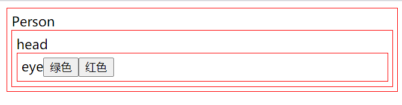

## Context
### 1. 组件中使用context
```jsx
import React, { createContext, Component } from "react";
import ReactDOM from "react-dom";

// context使用
let PersonContext = createContext();
class Person extends Component {
  state = {
    color: 'red'  
  }

  changeColor = (color) => this.setState({color})
  render() {
    return (
      <PersonContext.Provider value={{
        color: this.state.color,
        changeColor: this.changeColor
      }}>
        <div style={{border: `1px solid ${this.state.color}`, padding: '5px'}}>
          Person
          <Head/>
        </div>
      </PersonContext.Provider>
    );
  }
}
/* 函数组件中使用context */
function Head() {
  return (
    <PersonContext.Consumer>
      {(colorValue) => (
        <div
          style={{ border: `1px solid ${colorValue.color}`, padding: "5px" }}
        >
          head
          <Eye />
        </div>
      )}
    </PersonContext.Consumer>
  );
}
/* 类组件中使用context */
class Eye extends Component {
  static contextType = PersonContext
  changeColor = (color) => this.setState({color})
  render() {
    return (
        <div style={{border: `1px solid ${this.context.color}`, padding: '5px'}}>eye
        <button onClick={() => this.context.changeColor('green')}>绿色</button>
        <button onClick={() => this.context.changeColor('red')}>红色</button>
        </div>
    );
  }
}

ReactDOM.render(<Person />, document.getElementById("root"));
```
- 通过`context`修改颜色，统一改变父亲，孙子，儿子的颜色


### 2. context实现原理
```js
// react.js 添加创建context的方法
function createContext(initialValue={}){
  let context = {Provider,Consumer}; // 返回两个函数组件
  function Provider(props){
    // 如果有值就赋值，没有就赋初始值
     context._currentValue = context._currentValue||initialValue;
     /* 
        - 修改统一内存地址的context，所有组件都用同一个地址，这样修改就都修改了
        - 不可以用扩展运算符，用了内存地址就变了
     */
     Object.assign(context._currentValue,props.value); 
     return props.children; // 把组件的孩子返回
  }
  // 函数组件只能使用consumer，类组件可以使用this.context 也可以用consumer
  function Consumer(props){  
    // 把当前的context，传给children当props
    return props.children(context._currentValue);
  }
  return context;
}
```

```js
// react-dom.js 在类组件初次挂载的时候给this.context赋值
function mountClassComponent(vdom){
  if(type.contextType){
    // 把用户传入的static contextType = PersonContext静态属性取出来赋值给this.context
    classInstance.context = type.contextType.Provider._value;
  }
}
```

## 高阶组件

### 1. 属性代理（给组件添加新功能）

```jsx
import React, { Component } from "react";
import ReactDOM from "react-dom";

/* 
  属性代理
*/

// 一个函数，传入参数，返回一个函数，函数里面返回一个类组件
let withLoading = loadMessage => OldLoading => {
  return class newHelloLoad extends Component {
    show = () => {
      let div = document.createElement('div');
      let p = document.createElement('p');
      p.id = 'loading';
      p.style.color='red';
      p.innerText= loadMessage
      div.appendChild(p)
      document.body.appendChild(div)
    }
    hide = () => {
      document.getElementById('loading').remove()
    }
    render(){
      let extraProps = {
        show: this.show,  // 提取出公共的方法
        hide: this.hide
      }
      return <OldLoading {...this.props} {...extraProps} />
    }
  }
}

class SayHellow extends Component {
  render() {
    /* 通过props使用show和hide */
    return (
      <div>
        SayHellow
        <button onClick={this.props.show}>显示</button>
        <button onClick={this.props.hide}>隐藏</button>
      </div>
    )
  }
}
let Newhello = withLoading('加载中...')(SayHellow);
ReactDOM.render(<Newhello />, document.getElementById("root"));
```


### 2. 反向继承