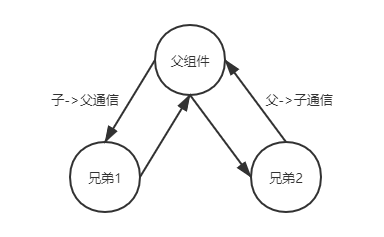

## Props
> react 是单向数据流（只能流向组件树中比自己层级更低的组件），在组件的通信上 需要基于 Props 进行数据通信

### 父传子
- 利用props向下传递数据
- props是只读属性，子组件并不能更改
```jsx
import React from "react";
import ReactDOM from "react-dom";

const Father = () => {
  return <Child text="来自父亲的数据"></Child>;
};

const Child = ({ text }) => {
  return <div>{text}</div>;
};

ReactDOM.render(<Father />, document.getElementById("root"));
```
### 子传父
- 此方法，只能在子组件中有触发条件的时候，才可以获得内容
- 通过函数传递参数，让父亲获得子组件中传出的数据
```jsx
import React from "react";
import ReactDOM from "react-dom";

const Father = () => {
  const queryChildText = (text) => {
    console.log(text); // 来自孩子的数据
  };

  return <Child queryChildText={queryChildText}/>;
};

const Child = ({ queryChildText }) => {
  // 点击按钮父亲会获得“传给父亲的数据”
  return <button onClick={() => queryChildText("传给父亲的数据")}>按钮</button>;
};

ReactDOM.render(<Father />, document.getElementById("root"));

```
### 兄弟
- 兄弟之间的参数传递，需要通过父组件进行周转
- 父组件把从兄弟1那里拿到的数据。通过props，传给兄弟2
- 相当于 子传父 + 父传子
- 
```jsx
import React, { useState } from "react";
import ReactDOM from "react-dom";

const Borther2 = ({ text }) => {
  // 来自兄弟1的数据
  return <div>{text}</div>;
};

const Father = () => {
  const [text, setText] = useState("");
  const queryBorther1Text = (text) => {
    setText(text); // 来自兄弟1的数据
  };

  return (
    <>
      <Borther1 queryBorther1Text={queryBorther1Text}></Borther1>
      {/* 把从兄弟1那边拿到的数据，给到兄弟2 */}
      <Borther2 text={text}></Borther2>
    </>
  );
};

const Borther1 = ({ queryBorther1Text }) => {
  return (
    <button onClick={() => queryBorther1Text("传给Borther2的数据")}>
      按钮
    </button>
  );
};

ReactDOM.render(<Father />, document.getElementById("root"));
```
## 发布订阅

### 事件对象
```jsx
class MyEventEmitter {
  constructor() {
    this.eventMap = {};
  }

  on(type, handler) {
    if (!(handler instanceof Function)) {
      throw new Error("必须传入一个函数");
    }
    // 如果没有订阅过，新建一个队列
    if (!this.eventMap[type]) {
      this.eventMap[type] = [];
    }

    // 然后把当前的事件放进去
    this.eventMap[type].push(handler);
  }

  // 监听函数
  emit(type, ...params) {
    // 如果这个事件订阅过，把当前队列里面的函数，一个一个的取出来执行
    if (this.eventMap[type]) {
      this.eventMap[type].forEach((handler) => {
        handler(...params);
      });
    }
  }

  off(type, handler) {
    // 如果当前有这个函数，在队列里面找到，然后删除
    if (this.eventMap[type]) {
      // -1 >>> 0  是一个非常大的数，splice找不到，就不会删除
      this.eventMap[type].splice(this.eventMap[type].indexOf(handler) >>> 0, 1);
    }
  }
}

export const myEvent = new MyEventEmitter();
```

### 通过事件对象进行通信
- AB为兄弟关系
- A在初始化的时候订阅了setA事件
- 在B想给A数据的时候，点击按钮，A就会拿到B发来的数据，通过event类做数据中转
- 在离开页面的时候要取消订阅
```jsx
import React, { useState, useEffect } from "react";
import ReactDOM from "react-dom";
import { myEvent } from "./event.js"; // 通过事件对象做中转

const A = () => {
  const [a, setA] = useState("");
  useEffect(() => {
    const handler = (params) => {
      setA(`A订阅函数拿到${params}的内容`);
    };
    myEvent.on("setA", handler);
    return () => {
      myEvent.off("setA", handler);
    };
  }, []);
  return <div>{a}</div>;
};

const B = () => {
  const handleB = () => {
    myEvent.emit("setA", "来自B");
  };
  return <button onClick={handleB}>点击B发送数据</button>;
};

const Father = () => {
  return (
    <div>
      <A />
      <B />
    </div>
  );
};

ReactDOM.render(<Father />, document.getElementById("root"));
```

<!-- TODO  context  redux -->