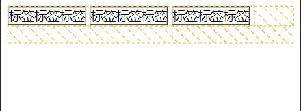

### 1. 把; 写成了,
- 把; 写成了,  js编译以为是变量，但是语句已经结束了。
```cmd
// 应为赋值或函数调用，但看到的却是表达式没有未使用的表达式
Expected an assignment or function call and instead saw an expression  no-unused-expressions
```

### 2. vscode鼠标左键多列选择
- 效果


- 解决(把这个模式勾选掉即可)


### 3. 过渡效果在定时器中才会生效
- 参考文章：[Javascript 高性能动画与页面渲染](https://www.infoq.cn/article/javascript-high-performance-animation-and-page-rendering/)
- 浏览器的执行阶段
    + 页面构建渲染：html代码解析之后构建dom对象css代码js代码执行
    + 事件执行：`addEventListener`，浏览器会一直监听事件队列中是否有事件需要执行
- 浏览器会一直循环上面的两个周期，这个时候我们在js代码中设置css代码，会重新触发页面的渲染，如果在js代码中添加了css类名的修改，浏览器会直接把css类名完全整合到下一次渲染中。这里如果你添加了过渡属性，渲染的时候css属性就已经是过渡之后的属性了，所以就不会再有过渡的效果。
- **异步**：添加异步操作，以前都是用`setTimeout`,现在推荐使用`requestAnimationFrame`也是异步操作，很多动画库都会用到，是浏览器渲染的一帧，所以应该也不会出现掉帧的问题。一般是16ms触发一次。
- 添加异步操作后，浏览器会在当前css类名加载完成之后，执行`setTimeout`中的函数，这时，同步设置的css属性已经生效了，再执行异步操作中的代码，就会有一个属性的转变了，就会出现过渡的效果了。
- 看了大佬的[视频](https://www.bilibili.com/video/BV1TA411T7ne)，通过`void div.offsetWidth`可以重新触发浏览器的渲染。（但是还是要具体问题具体问题）
- 浏览器时间环：微任务 -> 渲染 -> 宏任务，所以加了定时器之后在更改状态是已经在浏览器渲染过后了，然后在进行更新，就可以有一个变化

### 4. 让div盒子达到失焦效果
- tabindex属性表示元素是否可以聚焦的一个属性，也可以用tab键来访问下一个。
    + 如果是-1的话，表示可以聚焦，但是不能在鼠标tab键的时候访问到
    + 如果是0的话，表示可以聚焦，而且可以通过tab键不断访问
    + 如果是其他数字的话，点击键盘tab键会按给到的顺序不断访问

- 注意：tabindex 的最大值不应超过 **32767**。如果没有指定，它的默认值为 0
```html
<!-- 在项目中，自己用div和ul li写的下拉框没有和select option 一样的失焦效果，找到了这种方式解决 -->
<div tabindex = -1></div>
```

### 5. input pattern属性
```js
// 内部添加正则校验
<input pattern="regexp">
```

### 6. useState同时设置两个值，一个有值，一个为null
- 待解决

### 7. 一行div能展示多少就展示多少
- 业务需求，一开始看到这个需求的时候，脑子里想的都是用js解决，想先dom获取手机一行的长度，然后判断div长度，然后对比去看渲染多少个div。
- 但是后来突然幡然醒悟，需求既然是纯展示，那就用css的方法解决啊！为什么要用js，立刻改成了用flex解决。
```html
<div class="box">
    <span>标签标签标签</span>
    <span>标签标签标签</span>
    <span>标签标签标签</span>
    <span>标签标签标签</span>
    <span>标签标签标签</span>
</div>
```

```css
<style>
    .box {
        height: 24px;
        display: flex;
        /* 核心代码，让元素自动换行，然后把换行的元素直接hideen掉不展示 */
        flex-wrap: wrap;
        overflow: hidden;
    }
    .box > span {
        margin-right: 5px;
        border: 1px solid #000;
    }
</style>
```



### 8. sticky使用问题
```css
position: sticky;
```
- sticky使用时，因为缩放比例不是100%，导致浏览器中页面抖动，修改为100%就好了
- 如果出现空白。大佬说：translateZ(0px) 启动一下硬件加速（还不懂什么意思）
- 如果要获取offsetTop，js中fixed是获取不到高度的，但是sticky可以。

### 9. 滚动穿透
```css
overflow: hidden;
/* 或者 */
pointer-events none
```

### 10. react组件卸载后setState
- 报错：`Can't perform a React state update on an unmounted component. This is a no-op, but it indicates a memory leak in your application. To fix, cancel all subscriptions and asynchronous tasks in a useEffect cleanup function.`
- 问题是因为请求的时候，没有任何loading状态，这个时候用户点击其他操作，在页面已经卸载的时候，请求才刚刚完成，就会造成，在页面卸载之后进行setState的操作。出现报错信息。
```js
let [state, setState] = useState()
useEffect(() => {
    /* 
        1.设置一个query变量
        2.如果这个时候页面卸载了，query变成false，就不会进行state的设置
        3.利用了闭包的原理，query的值不会丢
    */
    let query = true;
    new Promise().then(res => {
        if(query) setState(res);
    }).catch((err) => err);

    return () => {
        // 组件卸载时置为false
        query = false;
    }
}, [])
```

### 11. flex布局在中ios中出现子元素高度塌陷
- 解决：给子元素添加height

### 12. position:sticky; 父级高度给100vh后失效
- 解决：去掉父元素的height：100vh，没有固定的高度，这样元素的父盒子就会是整个元素的本身的高度，就不会出现失效的问题。
- 如果当前元素有其他元素需要定位可以都是用stictky。

### 13. 给html渲染目录
```js
// 获取所有的标题HTML
function getHDom() {
	const titles = document.querySelectorAll('h1,h2,h3,h4,h5,h6');
	let arr = [];
	titles.forEach(title => {
		const type = title.nodeName.replace('H', '');
		arr.push({
			title: title.textContent,
			type,
			id: title.id,
		})
	});
	return arr;
}
```
- 用 padding * 目录层级
- 用a标签做锚点

### 日期
[intl](https://developer.mozilla.org/zh-CN/docs/Web/JavaScript/Reference/Global_Objects/Intl#locale_identification_and_negotiation)
[toLocaleDateString](https://developer.mozilla.org/zh-CN/docs/Web/JavaScript/Reference/Global_Objects/Date/toLocaleDateString)
```js
// 输入当天的星期
new Intl.DateTimeFormat('zh-CN', {weekday: 'long'}).format(new Date);
new Date().toLocaleDateString("default", {year: "numeric", month: "2-digit", day: "2-digit"}) // "2021/08/21"
```