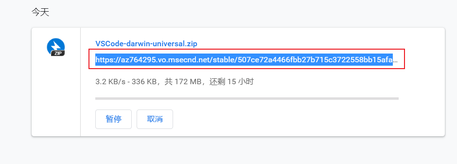

## vscode下载
> 替换国内镜像地址

- 在官网点击下载后，速度非常慢，打开看了之后，把当前的下载地址复制下来。
- https://`az764295.vo.msecnd.net`/stable/507ce72a4466fbb27b715c3722558bb15afa9f48/VSCode-darwin-universal.zip

- 然后替换中间的部分`az764295.vo.msecnd.net`,为`vscode.cdn.azure.cn`,复制到浏览器的url地址上下载就可以了。
- https://`vscode.cdn.azure.cn`/stable/507ce72a4466fbb27b715c3722558bb15afa9f48/VSCode-darwin-universal.zip

## Mac快捷键
- Command + H 隐藏(Hide)当前正在运行的应用程序窗口
- Command + Option + H 隐藏(Hide)其他应用程序窗口
- Command + W 关闭应用程序
- 打开finder：先进入桌面（进入桌面的快捷键command+H）任意位置，不要点击任何东西，然后按【cmmand+n】即可打开【finder】。
- Command + Delete 将文件移至废纸篓
- Command + Shift + Delete 清倒废纸篓
- Space 快速查看选中的文件，也就是预览功能
- Command + Q 退出(Quit)最前面的应用程序
- Command + Option + esc 打开“强制退出”窗口，如果有应用程序无响应，可在窗口列表中选择强制退出。
- 打开新窗口 ⌘ + n
- Command + → 将光标移至当前行的行尾
- Option + → 将光标移至下一个单词的末尾
- Control + A 移至行或段落的开头
- control + cmmand + Q 锁屏

## Mac手势
- 五指收拢 -- 打开启动台
- 双指按下 -- 右键